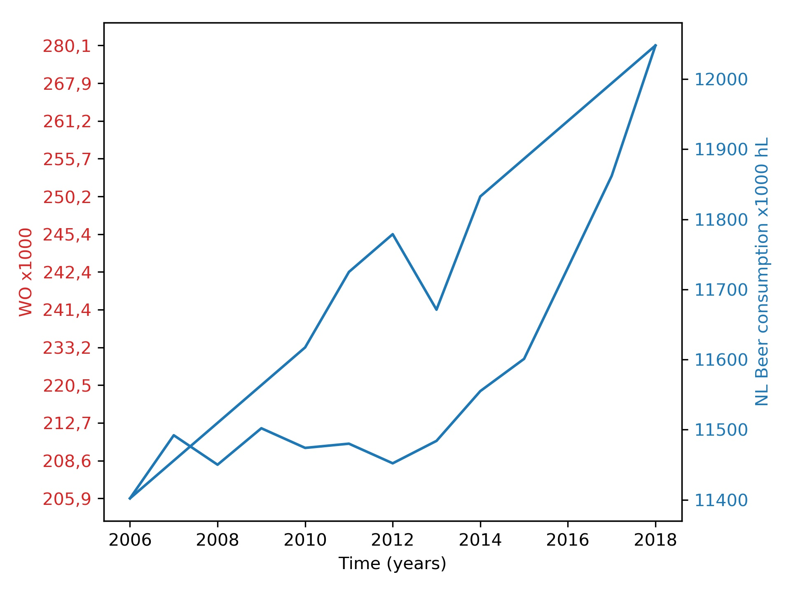

# CS Assignment

1. Create a free github account if you don't already have one.
2. Fork this repository.
3. Create a markdown (.md) named "solution_<your name>.md" file that will contain the following:
4. The title of the following papers pivotal to our knowledge:
- #### Fantastic yeasts and where to find them: the hidden diversity of dimorphic fungal pathogens
MCC Van Dyke et al.,2019

- #### An analysis of the forces required to drag sheep over various surfaces
JT Harvey, Applied Ergonomics, 2002

- #### The neurocognitive effects of alcohol on adolescents and college students
DW Ziegler et al., 2005

5. Create 1 plot from the dataset "istherecorrelation.csv", with DPI=300. The objective is to visualize the data as you see fit. Include the resulting image in the markdown file (and you can also write a few lines of interpretation if you like).

While it is possible to state that there exists a correlation, it is dangerous to do this looking at the image. As displayed in blue and red both lines follow a very different scale. When combining both in the same image it seems that they are almost the same.

To get a real understanding of there correlation I used numpy's corrcoef function to get the correlation value of both lines. This was around 82.5\% making them comfortably correlated.

6. Commit and push these two files to your fork.
7. Create a pull request for me to this (original) repo. (Hint: you can use the "New pull request" button and then do a "compare across forks").
